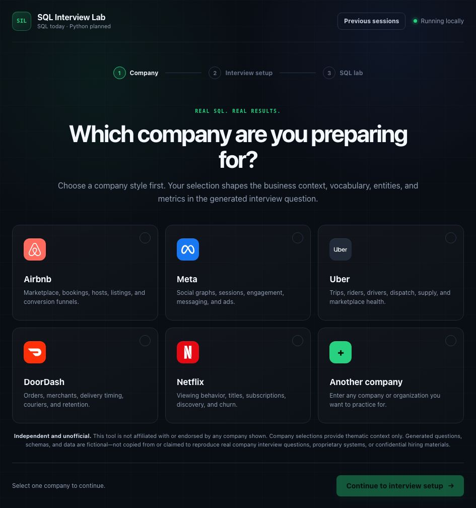
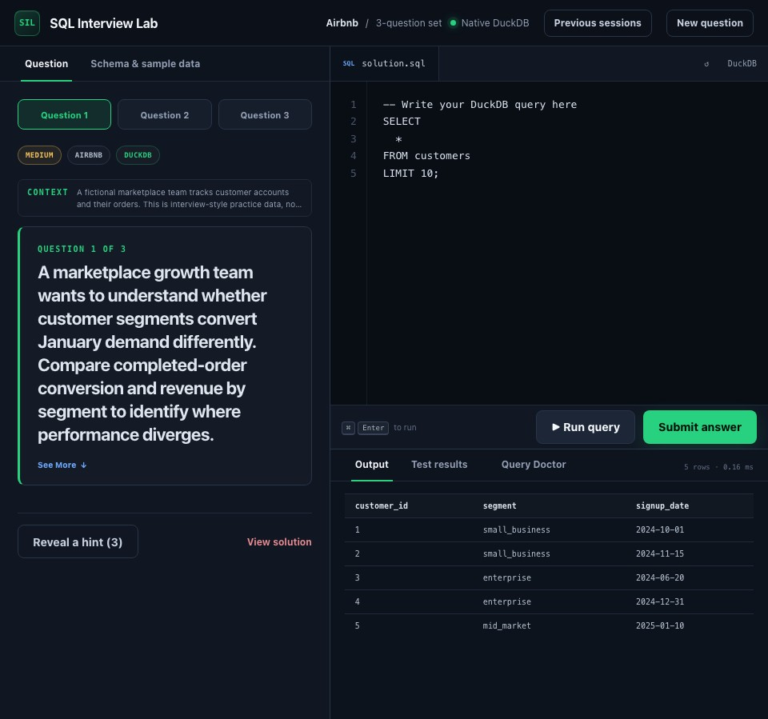

# SQL Interview Lab

[](https://github.com/mikeh-studio/sql-interview-lab/actions/workflows/ci.yml)
[](LICENSE)

SQL Interview Lab is a local SQL interview-practice environment with browser and terminal
interfaces. LLMs create exercises; DuckDB execution and deterministic comparison decide
whether an answer is correct.

The current SQL experience includes:

- offline static practice or structured three-question generation
- Codex CLI by default, with Claude CLI as an interchangeable local provider
- strict Pydantic validation before any generated exercise runs
- native DuckDB execution and clearly labeled warehouse-dialect emulation
- fresh databases plus visible and hidden grading datasets
- deterministic comparison of columns, rows, duplicates, NULLs, ordering, and numeric tolerance
- company-first browser setup, shared datasets, and task-first prompts
- Standard and Advanced interview modes, including debugging and analytical-case practice
- Query Doctor coaching only after execution and grading
- resumable local history with append-only submissions

SQL Interview Lab is independent and unofficial; it is not affiliated with or endorsed by
any company named in the app. Company selections describe fictional interview-style
approximations. Generated questions, schemas, and data are fictional: they are not copied from
or claimed to reproduce real company interview questions, proprietary systems, or confidential
hiring materials.

## Screenshots

### Company-first setup



### SQL workspace



## Why execution, not LLM grading

An LLM is useful for creating business context, schemas, sample data, questions, hints,
and explanations. It is not the source of truth for correctness.

```text
LLM provider
  -> validated exercise JSON
  -> shared DDL + visible/hidden seed data + 3 questions and reference queries

user SQL -----------------------> fresh DuckDB -> actual result
reference SQL -> separate fresh DuckDB --------> expected result
                                                   |
actual result + expected result -> deterministic comparator -> pass/fail + diff
                                                   |
                                                   v
                                optional Query Doctor CLI explanation
```

The user's SQL never has to resemble the reference SQL. Different queries pass when they
produce the same columns and values under the exercise's ordering and tolerance rules.

## Architecture

```text
src/sql_lab/
├── cli.py                    # terminal UI and local web launcher
├── config.py                 # environment-backed provider configuration
├── models.py                 # strict exercise/request schemas
├── services.py               # shared generation + runtime validation
├── engines/
│   ├── base.py               # SQLEngine contract
│   ├── duckdb_engine.py      # native in-memory DuckDB backend
│   ├── emulated_duckdb.py    # strict SQLGlot-to-DuckDB translation
│   └── factory.py            # native/emulated backend selection
├── exercises/
│   └── static.py             # offline SQL exercise
├── generation/
│   ├── prompts.py            # structured generation contract
│   └── generator.py          # strict JSON parsing + Pydantic validation
├── grading/
│   ├── compare.py            # deterministic result comparison
│   └── grader.py             # isolated execution across all datasets
├── feedback/
│   └── query_doctor.py       # post-grade structured CLI coaching
├── history/
│   ├── base.py               # backend-neutral HistoryRepository contract
│   └── sqlite_repository.py  # local SQLite snapshots and submissions
├── llm/
    ├── base.py               # LLMProvider interface
    ├── command.py            # shell-free subprocess transport
    ├── codex_cli.py          # Codex structured-output adapter
    └── claude_cli.py         # Claude structured-output adapter
└── web/
    ├── app.py                # local FastAPI session/API boundary
    ├── sessions.py           # isolated in-memory practice sessions
    └── static/               # responsive HTML/CSS/JavaScript workspace
```

Generation, execution, grading, and presentation communicate through typed domain
objects. DuckDB is the native backend. Redshift, BigQuery, Snowflake, Databricks SQL,
and Presto use a separate, clearly labeled emulation backend that parses the selected
dialect with SQLGlot, translates supported SQL to DuckDB, and fails when SQLGlot reports
an unsupported translation. Emulation is useful for local practice, but it is not claimed
to reproduce every native warehouse semantic.

## Installation

Python 3.12 or newer is required.

```bash
cd /path/to/sql-interview-lab
python3.12 -m venv .venv
source .venv/bin/activate
python -m pip install -e '.[dev]'
```

If needed, substitute another Python 3.12+ executable such as `python3.13`.

## Launch the browser interface

```bash
sql-lab --web
```

This starts a local server at `http://127.0.0.1:8765` and opens the interface. Use a
different port or keep the browser closed when needed:

```bash
sql-lab --web --port 9000 --no-open
```

If the lab is already running, the same command reopens it. If the executable is not found,
activate the project environment first:

```bash
source .venv/bin/activate
sql-lab --web
```

The former `data-interview-lab` command remains available as a compatibility alias.

The browser flow is staged:

1. Select a preset company style or enter another organization.
2. Choose a dialect, difficulty, provider, and optional context.
3. Generate three questions over one shared dataset, or use the instant Airbnb demo.
4. Run SQL and submit answers against visible and hidden datasets.
5. Use **Query Doctor** for post-grade coaching or **Previous sessions** to resume work.

Standard Mode provides three SQL problems. Advanced Mode adds a focus area, SQL construction,
debugging, and an analytical case with a deterministically graded SQL deliverable. Its rubric is
for self-review only; it never overrides the database grader or assigns a hiring score.

Advanced Mode validates Question 1 and opens the lab while Questions 2 and 3 generate in
parallel. It can reuse a matching local dataset. Every run reseeds DuckDB; hidden data and
reference SQL stay server-side until **View solution** is explicitly confirmed.

## Local session history

Browser sessions are saved by default to:

```text
~/.sql-interview-lab/history.db
```

An existing `~/.data-interview-lab/history.db` is reused in place when the primary SQL Lab path
does not yet exist, so saved practice history survives the rename.

Saved sets contain the validated exercise, latest SQL, pass/fail state, revealed hints, solution
state, and append-only submissions. They exclude routine run output, expected results,
credentials, and provider environment variables. The default retention limit is 200 sets.

The same private SQLite file stores a compact generation audit: stages, duration, CLI identity,
resolved model, cache use, and reported prompt/token counts. It excludes prompts, responses,
reference SQL, and generated rows. A separate local cache retains the 50 most recently used
shared datasets. **Clear all history** removes sessions, audit logs, and cached datasets.

Use **Save this session locally** to opt out. **Previous sessions** can resume, delete, or clear
saved work after a restart.

The path and retention limit are configurable:

```bash
export SQL_LAB_HISTORY_DB='/path/to/sql-interview-lab-history.db'
export SQL_LAB_HISTORY_LIMIT=200
sql-lab --web
```

`SQL_LAB_*` variables take precedence; former `DATA_INTERVIEW_LAB_*` names remain supported
as compatibility fallbacks.

## Security and privacy

Keep the unauthenticated server on its default `127.0.0.1` address; do not expose it to an
untrusted network. Exercises and attempt history remain local and should not enter source
control. See [SECURITY.md](SECURITY.md) for full guidance.

## Run the offline exercise

No LLM tool, API key, or network access is needed:

```bash
sql-lab --static
```

Useful commands inside the shell:

| Command | Behavior |
| --- | --- |
| `.run` | Execute the current SQL buffer on the visible database |
| `.submit` | Grade the buffer on every fresh visible/hidden dataset |
| `.schema` | Show table descriptions and DDL |
| `.tables` | List tables |
| `.hint` | Reveal the next hint |
| `.solution` | Explicitly reveal the reference SQL |
| `.clear` | Clear the SQL buffer |
| `.reset` | Recreate the visible in-memory database |
| `.new` | Start another exercise |
| `.quit` | Exit |

Ending a SQL statement with `;` runs it immediately. `.submit` never compares SQL text
and does not reveal the reference SQL.

## Generate exercises with Codex CLI

Codex is the default provider. Follow the
[official Codex CLI instructions](https://learn.chatgpt.com/docs/codex/cli), sign in, and verify
the installation:

```bash
codex --version
```

Start an interactive generated session:

```bash
sql-lab
```

Or provide the setup non-interactively:

```bash
sql-lab \
  --llm codex \
  --company "Acme Health" \
  --dialect snowflake \
  --difficulty medium \
  --additional-context "Focus on subscription retention and patient engagement"
```

The adapter calls `codex exec` with stdin, `shell=False`, a read-only sandbox, and an Exercise
JSON Schema. It validates the response locally and reuses Codex CLI authentication, so no API
key is required.

The command prefix and timeout are configurable without changing application code:

```bash
export SQL_LAB_CODEX_COMMAND='codex exec --ephemeral --sandbox read-only --skip-git-repo-check --color never'
export SQL_LAB_LLM_TIMEOUT=600
export SQL_LAB_ADVANCED_LLM_TIMEOUT=1200
sql-lab --llm codex
```

Standard Mode defaults to 600 seconds. Each Advanced Mode call defaults to 1,200 seconds; the
remaining questions run concurrently after Question 1 passes validation.

Do not add the final prompt sentinel or `--output-schema` to
`SQL_LAB_CODEX_COMMAND`; the adapter supplies both.

## Optional Claude CLI provider

If the `claude` CLI is installed and authenticated locally, select it with:

```bash
claude --version
sql-lab --llm claude
```

Override its command prefix if needed:

```bash
export SQL_LAB_CLAUDE_COMMAND='claude --print --no-session-persistence --permission-mode dontAsk --tools ""'
```

The Claude adapter also uses stdin, `shell=False`, and native JSON Schema output.

## Optional API providers

API-backed providers are not implemented in this release; no API package or secret is needed.

## Dialect support

| Dialect | Model value | Execution status |
| --- | --- | --- |
| DuckDB | `duckdb` | Fully supported, native in-memory execution |
| Amazon Redshift | `redshift` | Emulated locally through SQLGlot and DuckDB |
| BigQuery (GoogleSQL) | `bigquery` | Emulated locally through SQLGlot and DuckDB |
| Snowflake | `snowflake` | Emulated locally through SQLGlot and DuckDB |
| Databricks SQL | `databricks` | Emulated locally through SQLGlot and DuckDB |
| Presto | `presto` | Emulated locally through SQLGlot and DuckDB |

The selected dialect applies to generation, parsing, and grading. The UI always labels native
versus emulated execution. Emulation excludes cloud-only services, external objects, UDFs, and
engine-specific behavior SQLGlot cannot translate faithfully.

## Tests

```bash
pytest
```

The unit and API suite enforces a 75% project coverage floor. Run the real-browser journey
after installing its Chromium runtime:

```bash
python -m playwright install chromium
pytest e2e -q --no-cov
```

The browser test starts the local server, loads the instant demo in Chromium, executes and
submits the reference query against visible and hidden datasets, and verifies saved history.
It does not call an LLM provider.

The suite covers deterministic grading, engine isolation, all emulated dialects, CLI failures,
structured generation, progressive loading, local history/cache behavior, and browser API flows.

## Roadmap

- Python interview practice
- persistent company packs and Practice/Interview/Review policies
- optional API providers and native warehouse engines
- timers, editor autocomplete, richer hidden datasets, and optional history export
